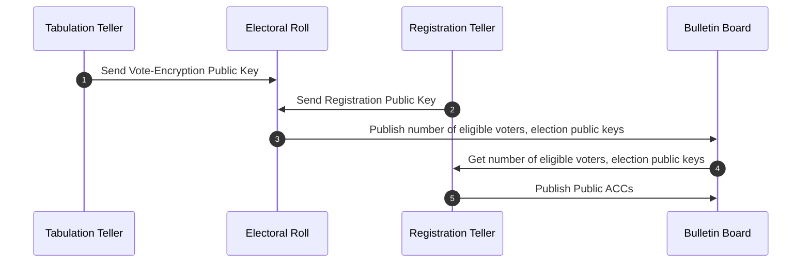
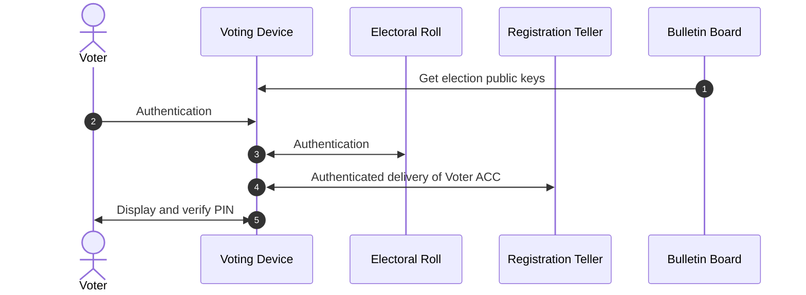
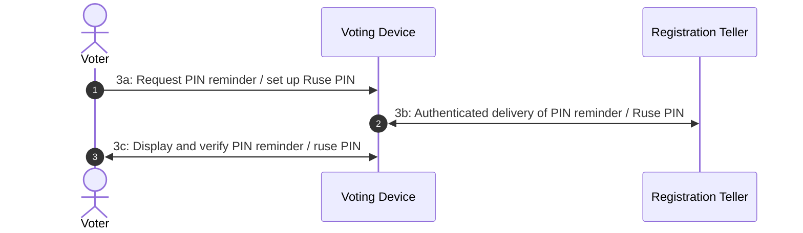
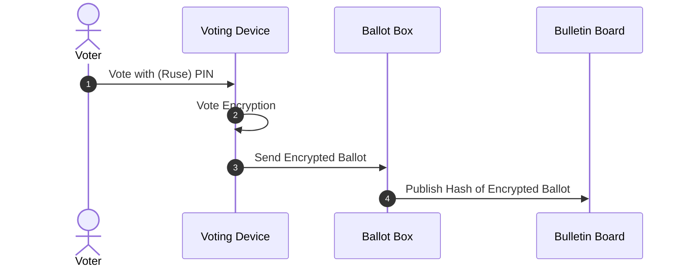
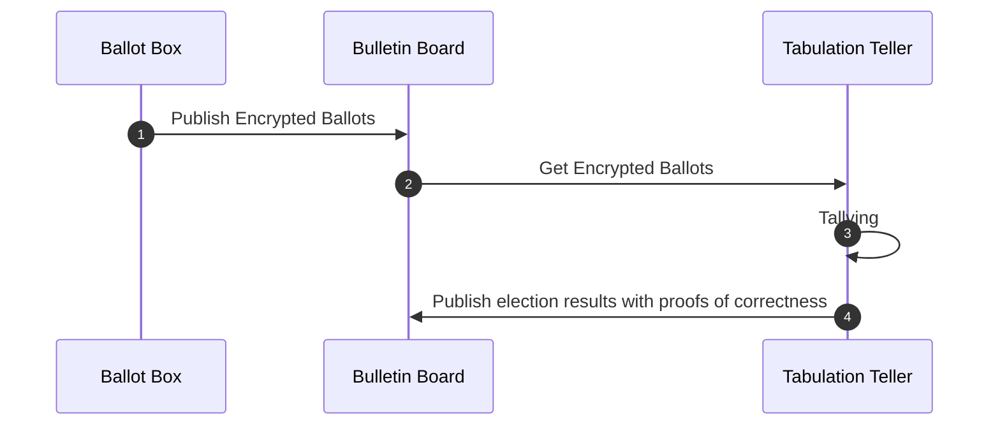

# eVoting Cryptographic Library (Rust)

This repository implements a verifiable end-to-end voting protocol
based on ElGamal encryption and Sigma protocols.

## ⚠ Security Disclaimer

> [!CAUTION]
> This codebase is meant for **research, evaluation, and prototyping**, not for production use.

## High-level overview

The e-voting protocol here implemented[^LMST22][^BLMMSST23] is derived from Civitas[^CCM08], improved with the techniques of[^ABRRTY10][^AT13][^dSA08] to have a vote tally linear in the number of votes, with threshold construction of the voting credential derived from[^WZF05] and with coercion-resistant voting credentials[^JCJ10].

### Voting phases

#### 1. Setup

The protocol parameters are chosen, and the public keys are generated (1.1 and 1.2) and published (1.3).

Given some election parameters (1.4), the registration authorities (Registration Tellers) cooperatively generate a voting credential for every eligible voter and publish the public parts (1.5).



#### 2. Enrollment

Using a voting device updated with the current election parameters (2.1), each voter authenticates to the voting platform (2.2), and the Electoral Roll (2.3) checks their status as eligible voters. 

The voting device requests from the RTs the voter's credential, which is delivered after a random waiting period (2.4).

The authorities also send a DVNIZKP, so that voters can verify the validity of the PIN shown by their device (2.5).



#### 3. Credential Management

Each voter can set up one or more ruse PINs (3.1) and verify them with the decoy DVNIZKP (3.3).

Each voter can also request to receive again their valid PIN (3.1) and/or verify a PIN with the DVNIZKP (3.3) (multiple times).

Both ruse PINs and reminders (3.2) are delivered and displayed exactly as in phase 2 (2.4, 2.5).



#### 4. Voting

Each voter expresses their preferences on their voting device and validates them by inserting a PIN (4.1).

The device creates an encrypted ballot (4.2) and casts it (4.3).

For confirmation, a hash is published on a Web Bulletin Board (WBB) (4.4).

Each voter can simulate multiple votes by using their decoy PINs or express their real preference with their valid PIN.

Re-voting is allowed; only the last ballot cast with the valid PIN will count in the final tally.



#### 5. Tallying

When the voting period ends, the encrypted ballots are released by the Ballot Boxes (5.1).

Duplicate, malformed and invalid ballots are set aside after being verifiably mixed by the tallying authorities (Tabulation Tellers).

The remaining ballots are fetched (5.2) and counted (5.3), and proofs of correct tally execution are published (5.4).



### Anti-Coercion Credentials (ACC)

These credentials allow voters under the influence of a coercer to express their true votes while pretending to comply with the coercer's demands.

Each voting credential comprises a private and a public part and will be used to validate cast ballots.
When the voter is, or fears they may be, subject to a coercion attack, they can autonomously create a decoy credential indistinguishable from the real one. This credential will not validate the corresponding ballot when votes are tallied.
The coercer cannot understand if a ballot has been built with a decoy or valid credential, since this distinction emerges only when the votes are tallied after all ballots have been shuffled.

To enhance usability of the scheme, in[^LMST22][^BLMMSST23] the credential is provided to the voter in the form of a six-digit PIN mask. 
When inserted during the voting phase, this PIN unmasks the valid credential needed to cast a valid vote. 
To create a decoy credential, it is sufficient to set up a decoy PIN.
The decoy credential is then delivered to the voter in the same way as the valid one, by a process indistinguishable from the genuine one to the coercer.

The correctness of the PIN can be verified via a Designated Verifier Non-Interactive Zero-Knowledge Proof (DVNIZKP), which proves the correctness of the associated credential.
If a decoy PIN is set up, a forged proof is created to verify the decoy credential.

> [!NOTE]
> The manner in which voters authenticate themselves as entitled to vote to obtain voting credentials to cast valid ballots is out of scope of this library. A candidate for such authentication is an electronic national identification (eID) scheme, such as an eIDAS-notified scheme.


## Roles

The code is structured around four explicit roles:

- **Client (Voter).**  
The client runs on the voter device and is responsible for all voter-side cryptography. It generates a voter key pair, receives a voting credential from the Registration Teller, constructs ballots with zero-knowledge proofs, and submits them to the bulletin board. The client can locally verify the correctness of the PIN associated with its credential. No plaintext vote information is ever revealed by the client.

- **Registration Teller (RT).**  
The Registration Teller is trusted for eligibility but not for vote privacy. It issues PIN-bound voting credentials and produces credential control proofs that allow invalid or unauthorized ballots to be filtered later in the pipeline. The RT never learns voter choices and never decrypts votes.

- **Bulletin Board (BB).**  
The Bulletin Board acts as an append-only public log and hosts the public verification pipeline. It stores ballots together with deterministic receipts, verifies ballot proofs, performs vote and credential shuffles with zero-knowledge proofs, filters invalid ballots, enforces revoting semantics, and homomorphically aggregates encrypted votes. All BB computations are publicly verifiable and can be re-run independently by any observer, auditor, or authority.

- **Tabulation Teller (TT).**  
The Tabulation Teller is trusted exclusively for decryption. It produces verifiable decryptions for credential validity checks, credential fingerprint matching, and final tally decryption. The TT outputs are publicly verifiable and can be checked by anyone.

Two additional roles are present in the protocol design but have no corresponding functions in this library since they perform only standard cryptographic operations, typically available from other libraries e.g., OAuth:

- Electoral Roll (ER)
-- Authenticates voters, checks their eligibility to vote in the currently active contests.
-- Issues pseudonymous authorization to receive voting credentials from RT.
-- Issues Casting Access Tokens to limit the rate of requests that a client can make to send ballots, to mitigate against brute force attacks on PIN numbers.
-- May be instanced as an OAuth Authorization Server. 

- Ballot Box (BBox)
Receives and stores ernctypted ballots, publishing their hash in the voting phase (4) and the full ballot in the Tallying phase (5).

## Performance measurements

The repository includes an ignored integration test that executes the full end-to-end protocol and reports wall-clock timings and serialized sizes of public artifacts. Measurements are aggregated per protocol step and per role (Client, BB, RT, TT).

The test can be run in optimized mode with:
```
cargo test --release --test bench_pipeline -- --ignored --nocapture
```

The results show that the Bulletin Board dominates runtime. This is expected, as the BB performs the most expensive public cryptographic operations, including proof verification and shuffles. The Tabulation Teller incurs a moderate and bounded cost due to verifiable decryptions, while the Registration Teller and client-side costs are comparatively small.

Importantly, this does not imply that voting is slow for users. Most BB work happens after voting has ended, is fully publicly verifiable, can be parallelized, and can be re-run offline by auditors. The reported measurements primarily reflect **audit and verification cost**, not online voting latency.

## Work in progress

Threshold cryptography for multiple RT and TT remains to be implemented.

The Bulletin Board currently persists data only in memory. A more robust solution with append-only guarantees is currently being planned.

## Out of scope

The present library only aims to implement the cryptographic functions of the voting system proper. The deployment of servers to expose this API as remote services is out of scope, including critical but more conventional identity and access management.

## Acknowledgements

This protocol has been developed in the context of a research project partly funded by the Italian national mint ([Istituto Poligrafico e Zecca dello Stato](https://www.ipzs.it/)).


## References

[^LMST22]: Longo, R., Morelli, U., Spadafora, C., and Tomasi, A. (2022). Adaptation
of an i-voting scheme to italian elections for citizens abroad.
*E-Vote-ID 2022*. Seventh international joint conference on electronic
voting. https://doi.org/10.15157/diss/027

[^BLMMSST23]: Bitussi, M., Longo, R., Marino, F. A., Morelli, U., Sharif, A.,
Spadafora, C., and Tomasi, A. (2023). Coercion-resistant i-voting with
short PIN and OAuth 2.0. *E-Vote-ID 2023*. https://doi.org/10.18420/e-vote-id2023_04

[^CCM08]: Clarkson, M. R., Chong, S., and Myers, A. C. (2008). Civitas: Toward a
secure voting system. *2008 IEEE Symposium on Security and Privacy*,
354–368. https://doi.org/10.1109/SP.2008.32

[^ABRRTY10]: Araújo, R., Ben Rajeb, N., Robbana, R., Traoré, J., and Youssfi, S.
(2010). Towards practical and secure coercion-resistant electronic
elections. *Cryptology and Network Security*, 278–297.
https://doi.org/10.1007/978-3-642-17619-7_20

[^AT13]: Araújo, R., and Traoré, J. (2013). A practical coercion resistant voting
scheme revisited. *International Conference on e-Voting and Identity*,
193–209. https://doi.org/10.1007/978-3-642-39185-9_12

[^dSA08]: dos Santos Araújo, R. S. (2008). *On remote and voter-verifiable
voting* \[PhD thesis\]. Technische Universität Darmstadt.

[^WZF05]: Wang, H., Zhang, Y., and Feng, D. (2005). Short threshold signature
schemes without random oracles. *Progress in Cryptology - INDOCRYPT
2005*, 297–310. https://doi.org/10.1007/11596219_24

[^JCJ10]: Juels, A., Catalano, D., and Jakobsson, M. (2010). Coercion-resistant
electronic elections. In *Towards trustworthy elections* (Vol. 6000, pp.
37–63). Springer. https://doi.org/10.1007/978-3-642-12980-3\\2
